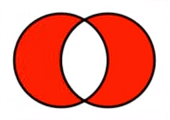

# Conjuntos - Estrutura de dados `set`

Um `set` é uma coleção (`collection`) que **não possui** objetos repetidos. Usamos para representar conjuntos matemáticos ou eliminar itens duplicados de um iterável.

Exemplo: se temos uma lista com vários elementos duplicados e queremos removê-lo, basta passarmos o construtor `set` com a lista dentro que ele retorna sem duplicidade.

O `set` espera um objeto iterável e ele não retorna um valor ordenado corretamente.

~~~python
set([1, 2, 3, 1, 3, 4]) # {1, 2, 3, 4}

set("abacaxi") # {"b", "a", "c", "x", "i"}

set(("palio", "gol", "celta", "palio")) # {"gol", "celta", "palio"}
~~~

### _Acessando os dados_

Conjuntos em Python **não suportam indexação** e nem **fatiamento**. Caso queira acessar os seus valores é necessário converter o conjunto para lista. 

~~~python
numeros = {1, 2, 3, 4}

numeros = list(numeros)

print(numeros[0]) # 1
~~~

### _Iterar conjuntos_

A forma mais comum para percorrer os dados de um conjunto é utilizando o `for`.

~~~python
carros = {"gol", "prisma", "celta"}

for carro in carros:
    print(carro)
~~~

### _Função_ `enumerate`

As vezes é necessário saber qual o índice do objeto dentro do laço `for`. Para isso usamos o `enumerate`.

~~~python
carros = {"gol", "prisma", "celta"}

for indice, carro in enumerate(carros):
    print(f"{indice}: {carro}")
~~~

### _Métodos da classe_ `set`

Todas as operações matemáticas que são realizadas com conjuntos podem ser feitas com o `set` em Python.

`{}.union`

Junta todos os elementos.

~~~python
conjunto_a = {1, 2}
conjunto_b = {3, 4}

conjunto_a.union(conjunto_b) # {1, 2, 3, 4}
~~~

`{}.intersection`

Retorna os valores que se conectam, que são iguais entre os dois conjuntos. 

~~~python
conjunto_a = {1, 2, 3}
conjunto_b = {2, 3, 4}

conjunto_a.union(conjunto_b) # {2, 3}
~~~

`{}.difference`

Retorna o valor diferente que tem no conjunto A em relação ao B e vice-versa.

~~~python
conjunto_a = {1, 2, 3}
conjunto_b = {2, 3, 4}

conjunto_a.difference(conjunto_b) # {1}
conjunto_b.difference(conjunto_a) # {4}
~~~

`{}.symmetric_difference`

Retorna os valores diferentes da intersecção, valores que são divergentes entre os dois conjuntos.

~~~python
conjunto_a = {1, 2, 3}
conjunto_b = {2, 3, 4}

conjunto_a.symmetric_difference(conjunto_b) # {1, 4}
~~~

`{}.issubset`

Retorna um valor booleano comparando se os valores de conjunto A estão contidos no B e vice-versa.

~~~python
conjunto_a = {1, 2, 3}
conjunto_b = {4, 1, 2, 5, 6, 3}

conjunto_a.issubset(conjunto_b) # True
conjunto_b.issubset(conjunto_a) # False
~~~