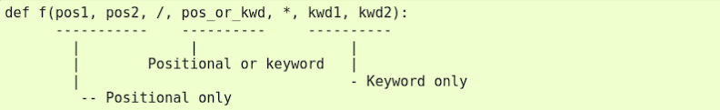

# Funções

Função é um bloco de código identificado por um nome e pode receber uma lista de parâmetros. Esses parâmetros podem ou não ter valores padrões. Usar funções tornam o código mais legível e possibilita o reaproveitamento de código. Programar baseado em funções, é o mesmo que dizer que estamos programando de maneira estruturada. 

Estrutura básica:

`def` + `nome_funcao(param1, param2, ...)` + `:`

Caso declare parâmetros:

`def exibir_mensagem_2(nome):` parâmetro sem operador de atribuição (`=`) e valor, se torna obrigatório passar algum valor ao executar a função.

`def exibir_mensagem_3(nome="Anônimo"):` parâmetro com valor atribuído se torna opcional passar algum valor ao executar a função. Caso não passe nenhum valor na execução, a função utilizará o que tiver declarado como parâmetro.

Exemplos:

~~~python
def exibir_mensagem():
    print("Olá mundo!")

def exibir_mensagem_2(nome):
    print(f"Seja bem vindo {nome}!")

def exibir_mensagem_3(nome="Anônimo"):
    print(f"Seja bem vindo {nome}!")

exibir_mensagem()
exibir_mensagem_2(nome="Guilherme")
exibir_mensagem_3()
exibir_mensagem_3(nome="Chappie")
~~~

### _Retornando valores_

Para retornar um valor, utilizamos a palavra reservada `return`. Toda função Python retorna `None` por padrão caso não retorne nenhum valor. Diferente de outras linguagens, em Python uma função pode retornar mais de um valor. 

Exemplo: 

~~~python
def calcular_total(numeros):
    return sum(numeros)

def retorna_antecessor_e_sucessor(numero):
    antecessor = numero - 1
    sucessor = numero + 1

    return antecessor, sucessor

calcular_total([10, 20, 34]) # 64
retorna_antecessor_e_sucessor(10) # (9, 11) - retorna uma tupla, exatamente para garantir que o valor não seja modificado
~~~

### _Argumentos nomeados_

Funções também podem ser chamadas usando argumentos nomeados da forma chave=valor.

Existe algumas nuances, vantagens e desvantagens ao utilizar os argumentos. 

Por padrão, caso passemos os valores sem nomeá-los, pode ocorrer de em algum momento invertermos a ordem e a própria função receber esses valores sem distinguir. 

Agora quando nomeamos, diminuímos o risco de passarmos valores diferentes para os argumentos, mas pode acontecer de em algum momento alguém alterar o nome do argumento da função e, caso não tenha alterado também na hora de executar a função, teremos um erro. 

~~~python
def salvar_carro(marca, modelo, ano, placa):
    # salva carro no banco de dados...
    print(f"Carro inserido com sucesso! {marca}/{modelo}/{ano}/{placa}")

salvar_carro("Fiat", "Palio", 1999, "ABC-1234") # Sem nomear
salvar_carro(marca="Fiat", modelo="Palio", ano=1999, placa="ABC-1234") # Nomeado
salvar_carro(**{"marca": "Fiat", "modelo": "Palio", "ano": 1999, "placa": "ABC1234"}) # Nomeado com dicionário. O uso dos dois ** significa que estamos passando um dicionário como argumento pra função. Conceito de kwargs

# Carro inserido com sucesso! Fiat/Palio/1999/ABC-1234
~~~

### _Args e kwargs_

Podemos combinar parâmetros obrigatórios com `args` e `kwargs`. Quando esses são definidos (*args e **kwargs), o método recebe os valores como tupla e dicionário respectivamente.

~~~python
def exibir_poema(data_extenso, *args, **kwargs):
    texto = "\n".join(args)
    meta_dados = "\n".join([f"{chave.title()}: {valor}" for chave, valor inkwargs.items()])
    mensagem = f"{data_extenso}\n\n{texto}\n\n{meta_dados}"
    print(mensagem)

exibir_poema("Sexta, 12 de Abril de 2024", "Zen of Python", "Beautiful is better than ugly.", autor="Tim Peters", ano=1999)
~~~

### _Parâmetros especiais_

Por padrão, argumentos podem ser passados para uma função tanto por posição quanto explicitamente pelo nome. Para uma melhor legibilidade e desempenho, faz sentido restringir a maneira pelo qual argumentos possam ser passados, assim, um desenvolvedor precisa apenas olhar para a definição da função para determinar se os itens são passados **por posição, por posição e nome, ou por nome**.

Na imagem podemos ver que tudo antes da barra `/` é apenas por posição e tudo após a barra `/` é considerado como posicional ou chave=valor; e tudo após o `*` é chave=valor.

- _Positional only_

~~~python
def criar_carro(modelo, ano, placa, /, marca, motor, combustivel):
    print(modelo, ano, placa, marca, motor, combustivel)

criar_carro("Palio", 1999, "ABC-1234", marca="Fiat", motor="1.0", combustivel="Gasolina") # válido

criar_carro(modelo="Palio", ano=1999, placa="ABC-1234", marca="Fiat", motor="1.0", combustivel="Gasolina") # inválido
~~~

- _Keyword only_

~~~python
def criar_carro(*, modelo, ano, placa, marca, motor, combustivel):
    print(modelo, ano, placa, marca, motor, combustivel)

criar_carro(modelo="Palio", ano=1999, placa="ABC-1234", marca="Fiat", motor="1.0",  combustivel="Gasolina") # válido

criar_carro("Palio", 1999, "ABC-1234", marca="Fiat", motor="1.0", combustivel="Gasolina") # inválido
~~~

- _Keyword and positional only_

~~~python
def criar_carro(modelo, ano, placa, /, *, marca, motor, combustivel)::
    print(modelo, ano, placa, marca, motor, combustivel)

criar_carro("Palio", 1999, "ABC-1234", marca="Fiat", motor="1.0", combustivel="Gasolina") # válido

criar_carro(modelo="Palio", ano=1999, placa="ABC-1234", marca="Fiat", motor="1.0", combustivel="Gasolina") # inválido
~~~